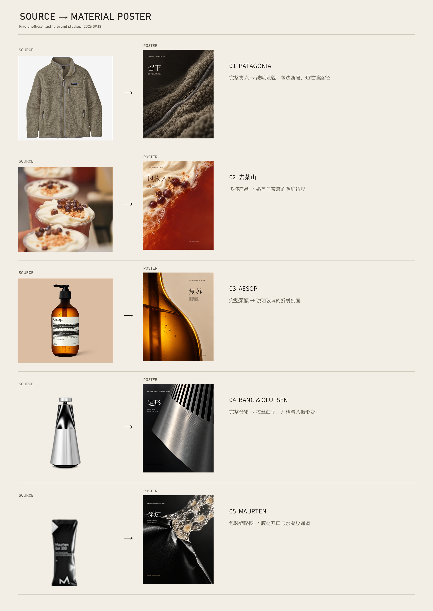
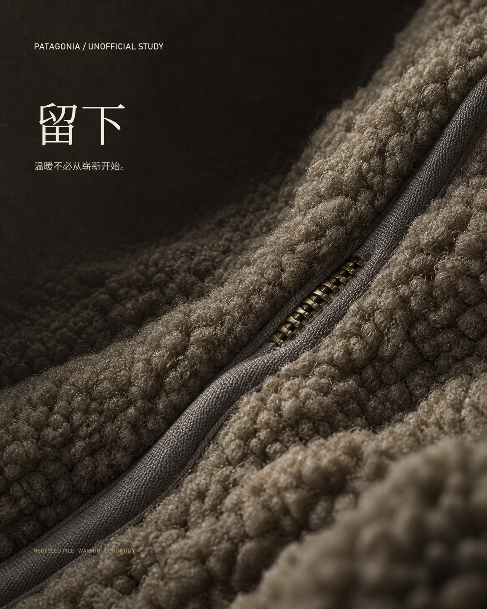
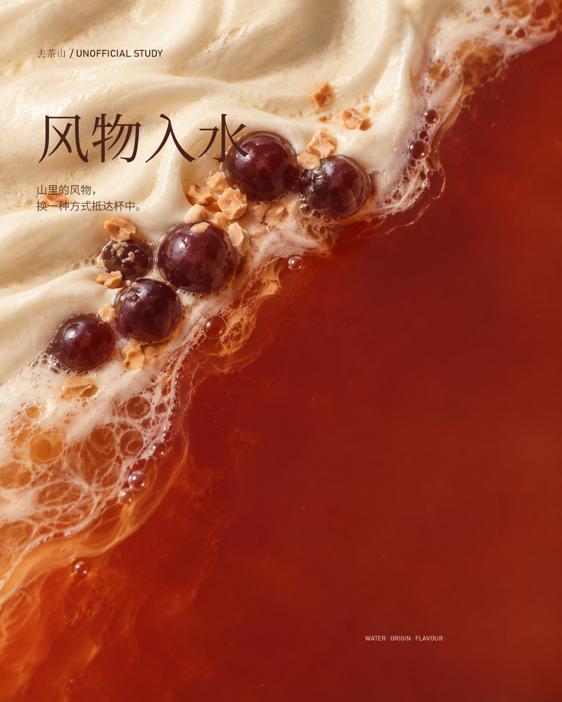
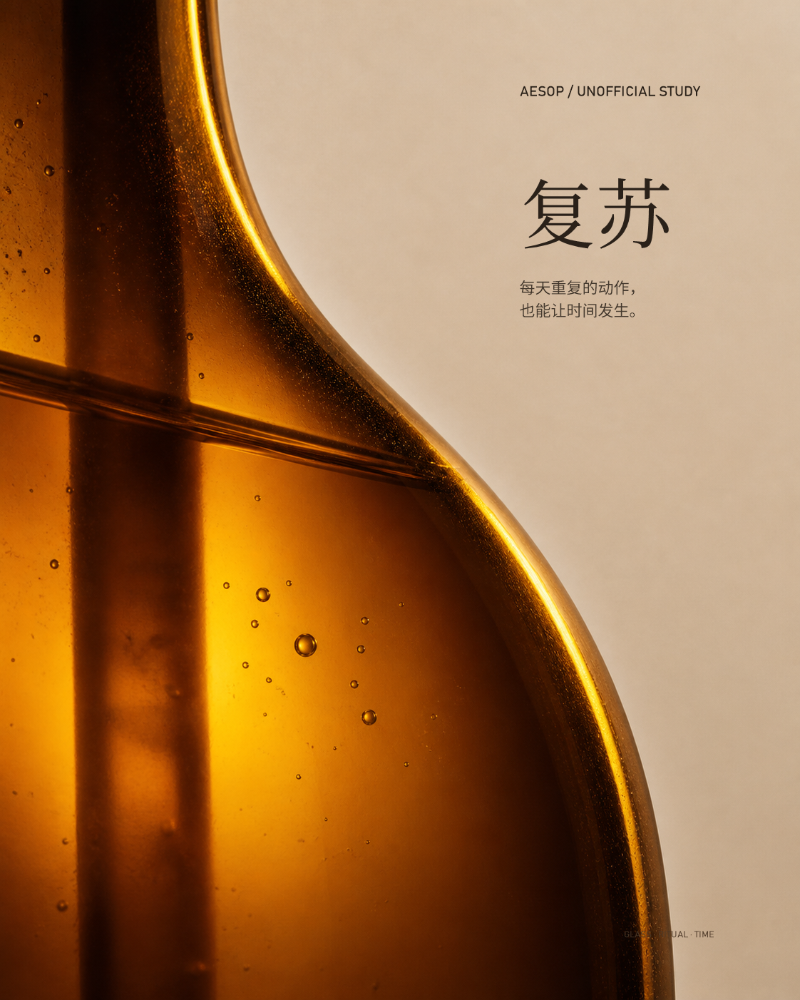
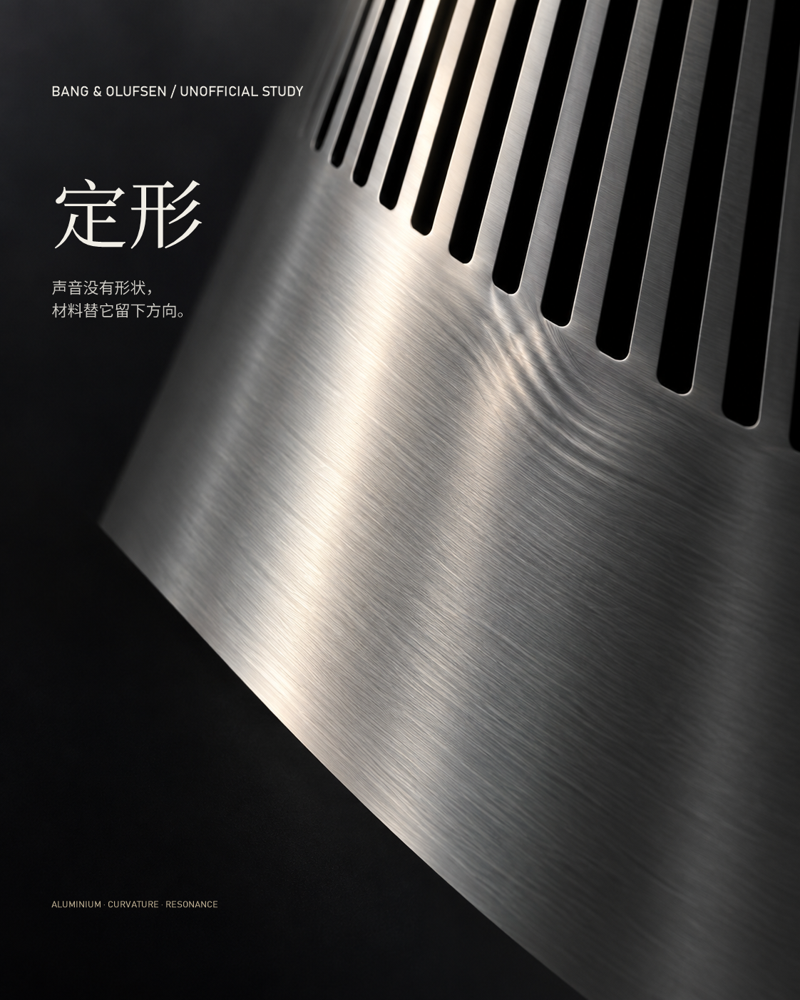
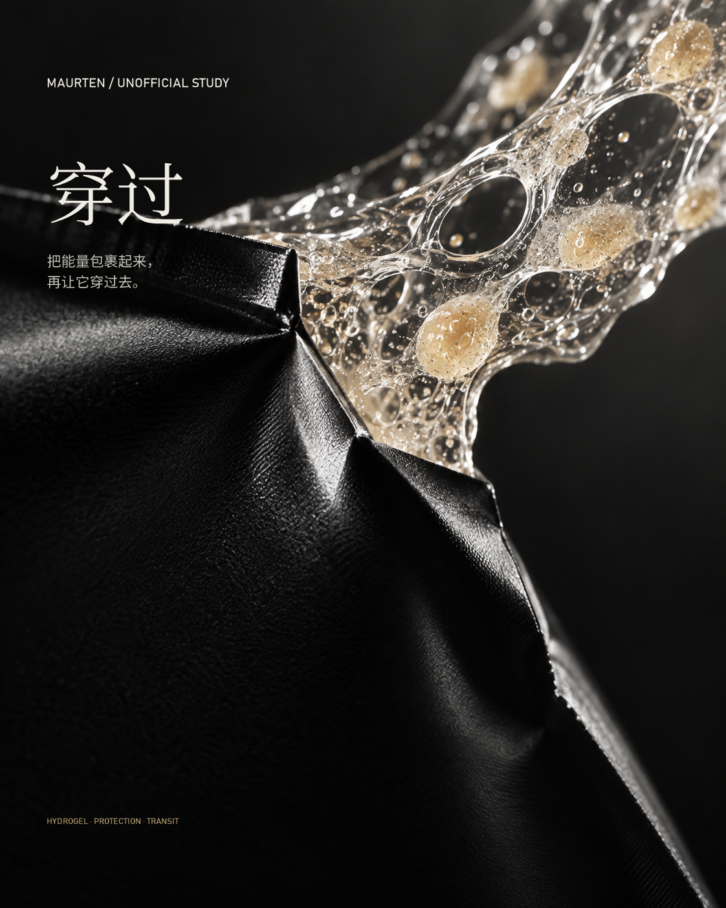

# Texture Poster · 材质肌理海报

把普通照片、产品图或品牌主题转译成一张以真实材质肌理承担概念的微距海报。它解决的不是“给照片加一层纹理”，而是先删掉无关场景，再让材质肌理、尺度、光线、负空间和准确排版共同传达一个隐性联想。



## 30 秒开始

在支持 Skills、本地图片读取和图像生成/编辑的 Agent 中直接说：

```text
用 $texture-poster-skill 把这张产品图转成一张 4:5 材质肌理海报。
不要保留完整产品，只保留 2–3 个不可替代的材质事实；先做无字母版，再准确排版。
```

也可以从纯主题开始：

```text
用 $texture-poster-skill 做一张关于“边界正在渗透”的海报。
主材质由你选择，只用一个转化关系，不显示网格，不做九宫格。
```

## 它会做什么

- 把输入拆成材质事实、身份锚点和可删除场景，而不是默认保留整张照片。
- 用一个“物理属性 → 概念感知”的命题选择材质，避免把肌理当装饰。
- 通过微距、尺度跃迁、面积重分配、接触线或相变建立唯一焦点。
- 先生成不含任何文字的视觉母版；通过硬门后再用真实字体精确排版。
- 用不可见网格组织对齐、留白和阅读顺序，但不把辅助线画进成品。
- 为网页素材记录来源、访问日期、用途、模型补充内容和权利状态。
- 用五项硬门与 100 分量表区分完成稿、方向稿和失败稿。

## 工作方式

```text
输入：图片或文字
      ↓
识神：分析概念动词 + 材质物理属性
      ↓
减法：保留 2–3 个事实 / 删除 50%–70% 场景
      ↓
聚焦：一个焦点 + 一个实验动作 + 不可见网格
      ↓
设计：无字视觉母版 → 五项硬门
      ↓
排版：真实字体精确排版 → 缩略图与来源检查
      ↓
校验：80 分以上且无硬失败 → 交付
```

完整执行入口见 [SKILL.md](SKILL.md)。

## 五个品牌实验

以下均为非官方实验作品，用于检验同一机制在五个赛道能否成立；不是品牌委托，也不代表已取得商业发布授权。

| 户外服饰 | 茶饮 | 身体护理 |
| --- | --- | --- |
|  |  |  |
| 羊羔绒成为“留下”的时间地貌 | 奶盖与茶液成为“风物入水”的边界 | 琥珀玻璃与气泡成为日常的时间容器 |

| 消费电子 | 运动营养 |
| --- | --- |
|  |  |
| 拉丝铝的曲率替无形声音“定形” | 热封膜与水凝胶形成“包裹—穿过” |

每个案例的原图页面、直链、保留事实、删除内容、模型补充和 SHA-256 见 [案例索引](examples/brand-source-studies/case-index.json)；转译判断见 [案例复盘](references/case-studies.md)。

## 适合与不适合

适合：品牌概念海报、产品材质肌理叙事、文化/自然主题、活动主视觉、编辑封面、带有真实表面证据的摄影转译。

不适合：电商白底主图、必须完整展示全部卖点的商品页、常规磨皮调色、信息密集长图、要求复制某张标杆构图的仿作。

## 输入建议

最有效的输入通常包含：

- 一张有真实表面细节的高分辨率照片；
- 一句传播目标，而不是一串风格词；
- 必须准确出现的标题、副标题和品牌限制；
- 对“还要不要认出原对象”的明确要求。

低清图只能证明包装或轮廓时，技能会把它标为 `structure-evidence`，不会假装其中存在可采样的微观纹理。

## 质量标准

母版必须通过五个硬门：视觉传达效果、缩略图、材质不可替换、减法、真实性。完整海报按主题—材质关系、材质主体化、抽象转译、编辑精调、焦点、图文整合、色光统一和独特性评分；80/100 以上才作为完成稿。

详见 [质量门控](references/quality-gates.md)。

## 目录

```text
texture-poster-skill/
├── SKILL.md
├── README.md
├── artifact-template.json
├── agents/openai.yaml
├── assets/
│   ├── reference.png          # 九张标杆组成的风格板
│   └── preview.png
├── references/
│   ├── creative-brief.md
│   ├── art-direction.md
│   ├── generation-workflow.md
│   ├── source-and-rights.md
│   ├── quality-gates.md
│   └── case-studies.md
├── examples/brand-source-studies/
│   ├── source-to-poster-contact-sheet.png
│   ├── case-index.json
│   └── *.png                  # 五张完成海报
└── scripts/validate_package.py
```

## 验证

校验包结构、案例索引、README 图片链接和输出尺寸：

```powershell
python scripts/validate_package.py
```

脚本只使用 Python 标准库，不安装依赖。它验证五张案例均为 `1122×1402`，联系表为 `2200×3100`。

## 使用边界

技能包中的五个品牌案例使用公开网页图片做内部、非官方、转化性测试。公开可访问不等于拥有商用权。正式投放前，使用品牌授权的 press kit、用户自有摄影或具有明确许可的图片，并核对商标、人物肖像与衍生使用范围。
